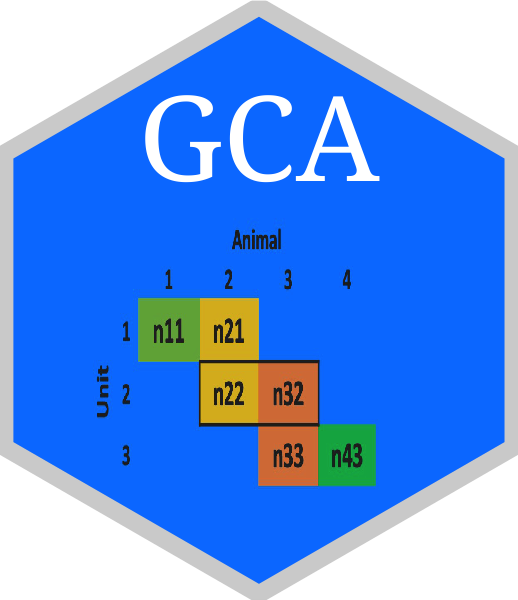

<!-- README.md is generated from README.Rmd. Please edit README.Rmd (this file) -->

```{r setup, echo = FALSE, warning = FALSE}
chooseCRANmirror(graphics = FALSE, ind = 1)
knitr::opts_chunk$set(
  collapse = TRUE,
  comment = "#>"
)
```

# GCA 

## Update: maintenance transition
Starting from July, 2024, the GCA R package will be maintained by the [AIAOS Lab at the University of Florida](https://github.com/uf-aiaos/GCA). The AIAOS Lab will handle all future maintenance, updates, and support for the package. 

## Overview 
An R package for genetic connectedness analysis using pedigree and genomic data. 

## Installation
GCA is currently available in Github, and can be installed with devtools package: 

1. Install `devtools` package from CRAN. 
```{r, warning = FALSE, message = FALSE, results = 'hide', eval = FALSE}
install.packages("devtools")
```

2. Load the `devtools` package.
```{r, warning = FALSE, results = 'hide', eval = FALSE}
library(devtools)
```

3. Install `GCA` package from Github.
```{r, warning = FALSE, results = 'hide', message = FALSE, eval = FALSE}
install_github('QGresources/GCA')
```

4. Load `GCA` package. 
```{r, warning = FALSE, results = 'hide', eval = FALSE}
library(GCA)
```

### Fail to load documentation (e.g., `?GCA`) after reinstalling GCA.
```{r,warning = FALSE, results = 'hide', eval = FALSE}
.rs.restartR() 
```

## Documentation
[Vignette](https://qgresources.github.io/GCA_Vignette/GCA.html)


## Reference
Haipeng Yu and Gota Morota. GCA: An R package for genetic connectedness analysis using pedigree and genomic data. BMC Genomics, 2021. [10.1186/s12864-021-07414-7](https://bmcgenomics.biomedcentral.com/articles/10.1186/s12864-021-07414-7)
